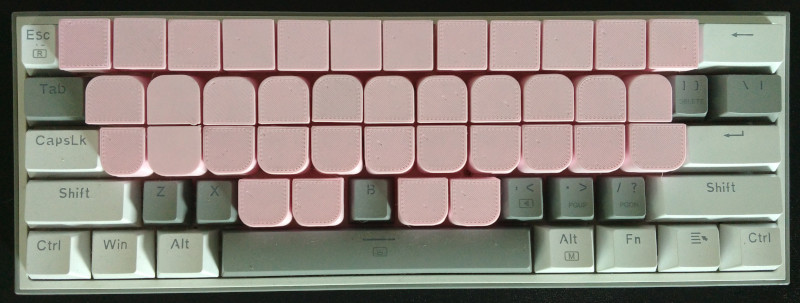

# StenoToppests

StenoToppests are a set of custom 3D printed keycaps which convert a mechanical keyboard into a stenotype look-alike.

StenoToppests are based on [StenoToppers](https://github.com/CemraJC/stenotoppers), but with the few changes:

- The stem holders on the original StenoToppers will snap off if printing in more brittle filaments. StenoToppests have a different keycap stem holder design that can allow using more brittle filaments.
- Can fit "dust-proof" type switches that have walls around the stem.

## Download

Download can be found in the [releases](https://github.com/0xca551e/stenotoppests/releases) section.

## Print instructions

Print the keycaps facing downwards. No supports are needed.

If your prints have stringing, you may want to avoid crossing over the plus-shaped hole when printing. If the nozzle strings inside the hole, the strings will block the stem from going in. Since the hole is tiny, stringing will be very difficult to remove.

- If you're using SuperSlicer, set `Print Settings -> Perimeters & Shell -> Quality -> Avoid crossing perimeters` to true.
  - Note: the option is only visible when expert mode is enabled. This can be set using the toolbar: `Configuration -> Mode -> Expert`

If you encounter other issues with the printed keycaps, such as the plus-shaped hole on the bottom ends up too tight or too loose, you may need to edit the design parameters. See [the next section](#editing) for more details.

You'll need to print the following amounts to be able to set up an entire keyboard:

- 18 standard keys
- 4 thumb keys
- 2 smaller corner keys
- 2 larger corner keys
- 12 number bar keys

## Editing

StenoToppests were designed with [FreeCAD](https://www.freecad.org/). To begin editing the design, open `stenotoppests.FCStd` with FreeCAD.

### Adjusting parameters

In `Spreadsheet`, you'll find a table of parameters, such as the dimensions of the key, stem offset, and hole size for each variant. When you edit a value here, the model will update.

#### Setting variant

The spreadsheet hold parameters for each key variant: `Standard`, `Thumb`, `Smaller corner`, `Larger corner`, and `Number bar`. To set the active variant, do the following:

- In the combo view, select `Body`.
- `Body` should have a dropdown property labeled `Configuration`. Select your desired variant here.

### Exporting

- In the combo view, select `Body`.
- Set the `Configuration` to the [desired variant](#setting-variant).
- `File -> Export...`
